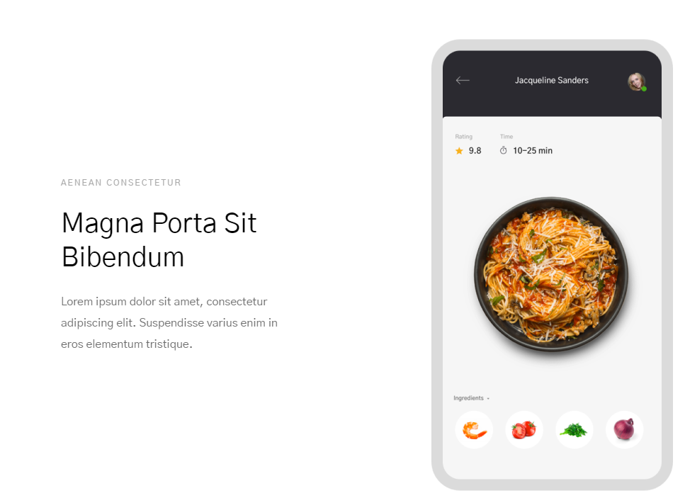

# laba1
## body

```
.head .head__hair .head__hair--color_black
.body .body__chest .body__chest--tattooed
.arm .arm__finger .arm__finger--ringed
```

<!-- header -->
```
header.header>.header__content.wrapper1200px>.header__navigation-content>nav.header__navigation.navigation>ul.navigation__list>(li.navigation__item*6>a.navigation__link)^^^.header__main-content>.header__text-content>h1.header__logo+p.header__logo-subtitle+button.header__button^img.header__image
```

<!-- form -->
```
form.form>fieldset.form__fieldset>(label.form__label--hidden>input.form__input)+button.form__subscribe
```


<!-- card -->
```
section.menu>.menu__card.card>.card__text-content>h2.card__title+h3.card__subtitle+p.card__text^img.card__image
```


<!-- section -->
```
section.download>.download__wrapper>h2.download__title+.download__buttons>button.download__button--download+button.download__button--touch
```
